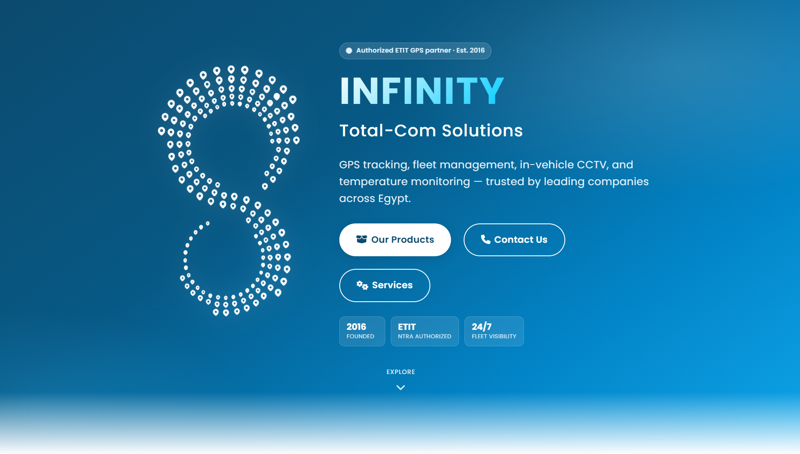
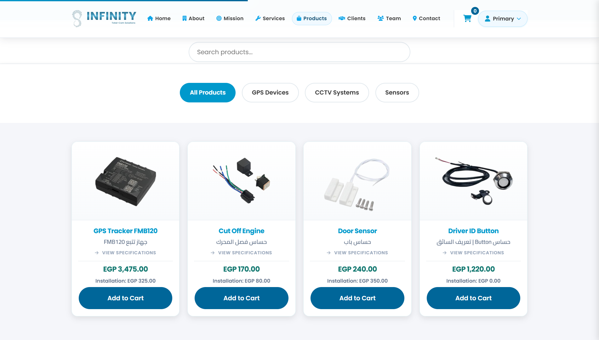
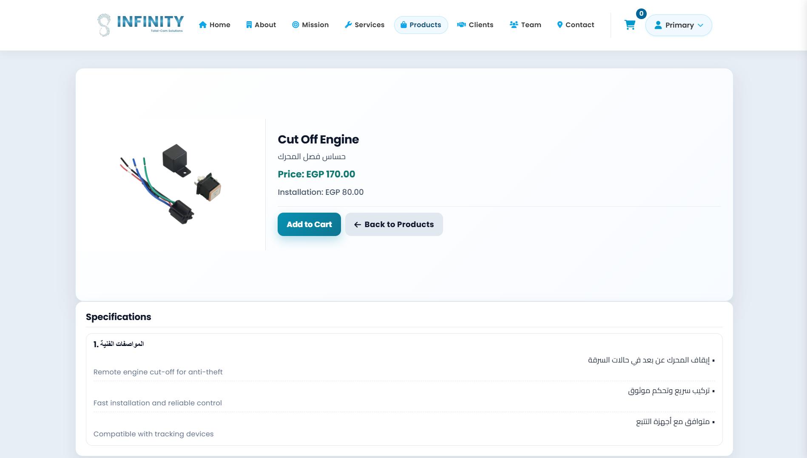
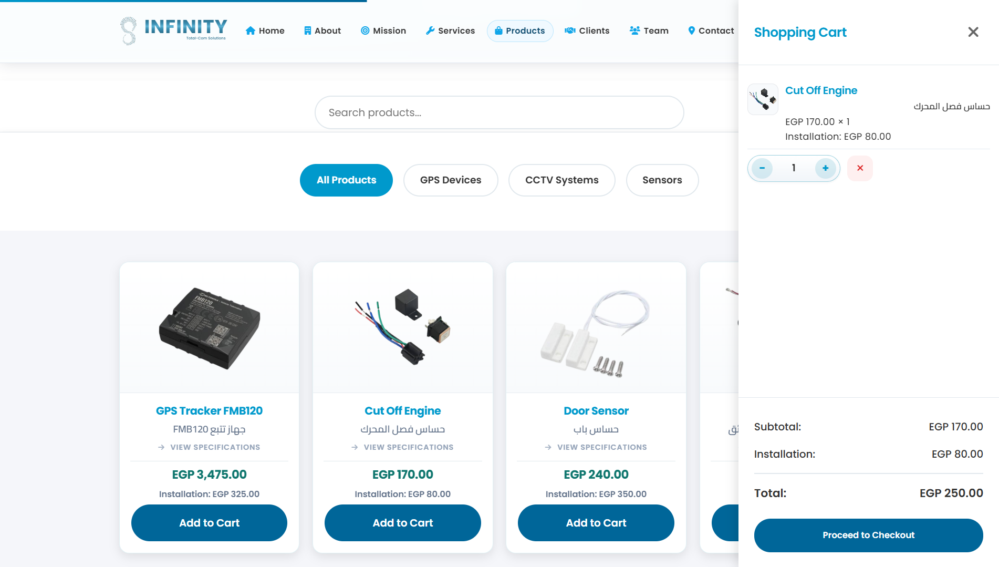
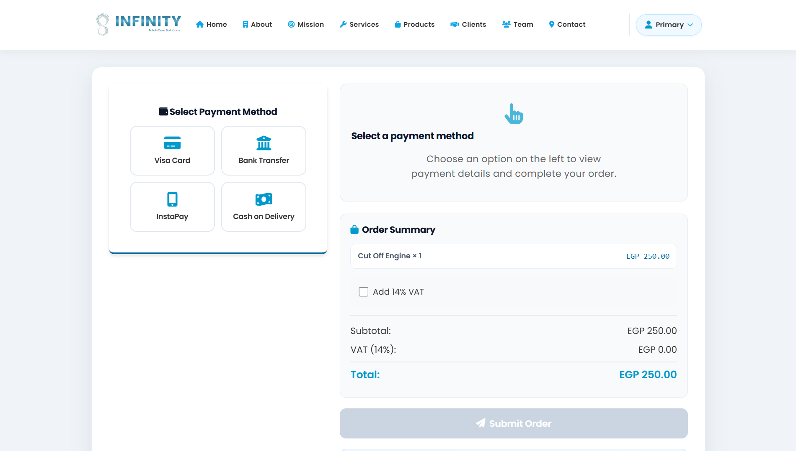
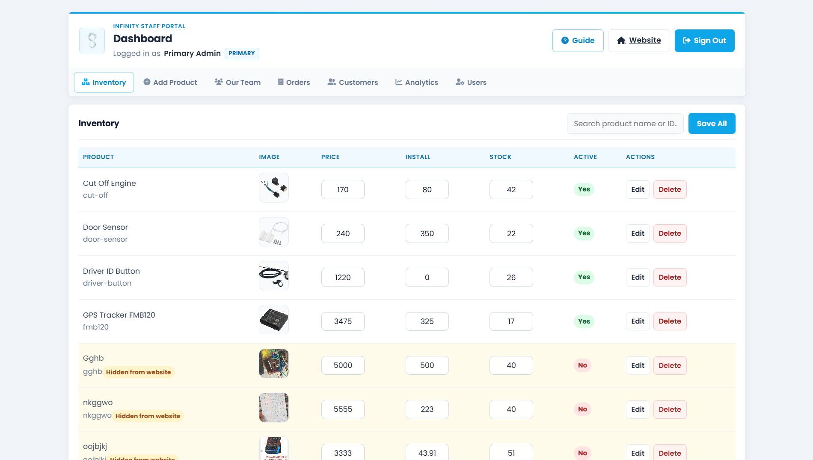
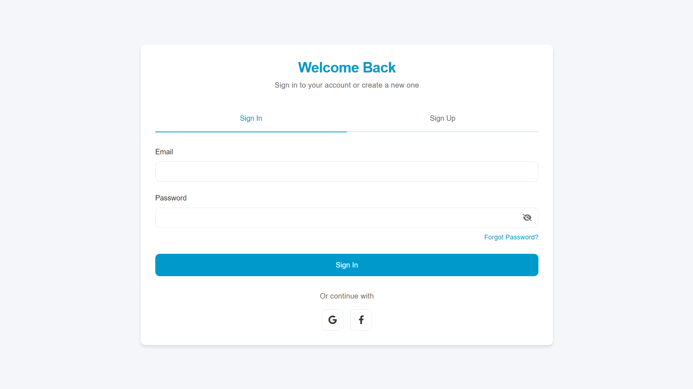
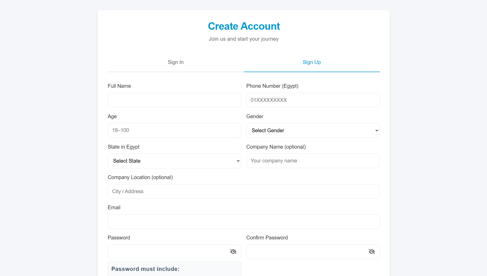
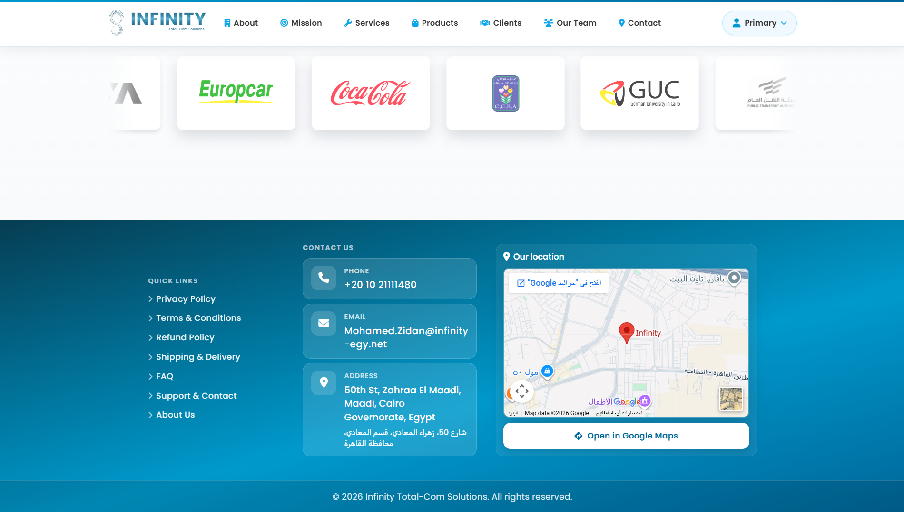

# INFINITY Total-Com Solutions

Modern responsive company website and integrated e-commerce platform for **INFINITY Total-Com Solutions** — Egypt's authorized ETIT GPS partner offering GPS tracking, fleet management, CCTV, and security solutions.

The project combines a marketing site, product catalog, shopping cart, multi-method checkout, customer order portal, and staff admin dashboard in a single **Node.js + Express + MongoDB** application with a vanilla HTML/CSS/JavaScript frontend.

> **Important:** Run the app with `npm start` and open **`http://localhost:3000`**. Opening HTML files directly (`file://`) or via Live Server will break API calls (cart, auth, products, dashboard, etc.).

---

## Table of Contents

- [Project Overview](#project-overview)
- [Features](#features)
  - [Website](#website)
  - [Products & E-Commerce](#products--e-commerce)
  - [Authentication](#authentication)
  - [Email Verification](#email-verification)
  - [Account Types & Profile](#account-types--profile)
  - [Support Tickets](#support-tickets)
  - [Identity Verification](#identity-verification)
  - [UI/UX Improvements](#uiux-improvements-production-polish)
  - [Notifications](#notifications)
  - [Password Recovery](#password-recovery)
  - [Dashboard](#dashboard)
  - [Loading System](#loading-system)
  - [Shared Footer](#shared-footer)
  - [Legal Pages](#legal-pages)
- [Technologies Used](#technologies-used)
- [Project Structure](#project-structure)
- [Installation](#installation)
- [Usage](#usage)
- [Validation](#validation)
- [Performance Optimizations](#performance-optimizations)
- [Responsive Design](#responsive-design)
- [Accessibility](#accessibility)
- [API Overview](#api-overview)
- [Environment Variables](#environment-variables)
- [Screenshots](#screenshots)
- [Future Improvements](#future-improvements)
- [Troubleshooting](#troubleshooting)
- [License](#license)

---

## Project Overview

**INFINITY Total-Com Solutions** is a full-stack web application built for a GPS and fleet-management company operating in Egypt. The site serves three audiences:

1. **Visitors & customers** — Learn about services, browse products, manage a cart, and place orders.
2. **Registered customers** — Track orders, download PDF invoices, and manage their profile.
3. **Staff** — Manage inventory, orders, customers, team members, analytics, and user accounts through a role-based dashboard.

The frontend is a multi-page application (MPA) with shared components (navbar, footer, loaders, validation), premium UI polish (hero animations, skeleton loaders, page transitions), and full responsive support from mobile through desktop.

The backend is an Express API with MongoDB persistence, session-based authentication, Cloudinary image hosting, and PDF invoice generation.

---

## Features

### Website

| Capability | Description |
|------------|-------------|
| **Responsive design** | Mobile-first layouts across home, products, team, legal, and dashboard pages |
| **Viewport-adaptive Hero** | Home Hero scales spacing, logo, and typography with `svh`/`dvh` and height-based breakpoints so the full section fits on short mobile screens |
| **Modern UI/UX** | Gradient hero, glass-style cards, premium contact footer, consistent typography (Poppins) |
| **Enhanced Hero intro animation** | Cinematic in-hero entrance on the home page (~2.6s staggered sequence; replays on every visit) |
| **Shared navbar** | `site-nav.js` injects unified top navigation on legal and utility pages |
| **Unified responsive navigation** | Home quick-nav, products nav, and legal-page nav adapt across desktop, tablet, and mobile |
| **Shared footer** | `site-footer.js` injects a unified three-column footer site-wide |
| **Page transitions** | Top progress bar on internal `.html` navigation via `InfinityLoader.initPageTransitions()` |
| **Hero entrance animations** | Staggered logo, headline, subtitle, CTAs, trust badges, and Explore scroll hint |
| **Accessibility** | ARIA labels, keyboard support, `prefers-reduced-motion` fallbacks, form `aria-invalid` states |
| **Offline awareness** | `connectivity.js` shows connectivity banners when the network is unavailable |
| **Scroll reveal** | Marketing sections animate into view on scroll (`script.js`) |
| **Responsive legal pages** | Documentation-style layout: sticky sidebar on desktop (≥1024px), stacked tablet, compact mobile TOC |

### Products & E-Commerce

| Capability | Description |
|------------|-------------|
| **Product catalog** | `products.html` — dynamic catalog from `/api/products/public` plus static seed products |
| **Category filtering** | Filter by GPS, CCTV, sensors, and related categories |
| **Product search** | Live text search across product names |
| **Product details** | `product-details.html?id=` — bilingual specification sections |
| **Installation pricing** | Per-product installation fee shown in catalog, cart, and checkout |
| **Shopping cart** | Persistent cart for logged-in users; viewport-fixed drawer (`cart-drawer.css`) |
| **Quantity controls** | Adjust item quantities; stock-aware add-to-cart |
| **Checkout flow** | `payment.html` — Visa, Bank Transfer, InstaPay, Cash on Delivery |
| **Receipt upload** | Bank Transfer & InstaPay require receipt image (Cloudinary or local fallback) |
| **Order confirmation** | `order-success.html` after successful checkout |
| **Customer orders** | `user-dashboard.html` — order history, filters, PDF download |
| **Stock management** | Out-of-stock badges; inactive products hidden from storefront |

### Authentication

| Capability | Description |
|------------|-------------|
| **Sign In / Sign Up** | `auth.html` — email/password with tabbed UI |
| **Account types** | Personal or Company account during registration |
| **OAuth** | Optional Google and Facebook login when env vars are configured |
| **Email verification** | New customers must verify email before login (`verify-email.html`) |
| **Complete Profile** | `complete-profile.html` — lightweight onboarding (phone, state, password) after sign-up or OAuth |
| **Profile page** | `profile.html` — edit account, contact, documents, security |
| **Support** | `support.html` — customer support tickets with chat-style replies |
| **Session handling** | `express-session` + `connect-mongo`; role-based redirects after login |
| **Client-side validation** | Shared `form-validation.js` module with live feedback |
| **Shared validation system** | Sign Up and Complete Profile reuse the same rules, checklist UI, and error styling |
| **Password validation** | Live checklist (length, upper, lower, number, special character) |
| **Egyptian phone validation** | Exactly 11 digits; prefixes 010, 011, 012, 015 |
| **Form error messages** | Per-field errors below inputs with red borders; errors clear on fix |
| **Password visibility toggle** | Show/hide icons on password fields |
| **Forgot Password** | `forgot-password.html` — request a 6-digit OTP by email |
| **OTP Verification** | `verify-otp.html` — 6-box code entry, 10-minute timer, 60s resend cooldown |
| **Reset Password** | `reset-password.html` — set a new password after OTP verification |

### Email Verification

New customer registrations require email verification before the account can sign in. Staff accounts (employee, manager, primary, technical) are auto-verified.

| Step | Page | Description |
|------|------|-------------|
| 1 | `auth.html` | Sign up (Personal or Company account) |
| 2 | Email (Brevo) | Branded verification email with secure link (15-minute expiry) |
| 3 | `verify-email.html` | Click link or resend verification email |
| 4 | `auth.html?verified=1` | Sign in after successful verification |

**Security:** bcrypt-hashed single-use tokens (`EmailVerificationToken`), rate-limited resend (3 per 15 min), login blocked with `EMAIL_NOT_VERIFIED` until verified. OAuth users are verified automatically. Existing users are migrated to `emailVerified: true` on startup.

**Backend:** `services/emailVerificationService.js`, `routes/emailVerificationRoutes.js`, `models/EmailVerificationToken.js`

### Account Types & Profile

| Type | Registration fields | Stored as |
|------|---------------------|-----------|
| **Personal** | Full name, phone, address, city, country, optional DOB | `accountType: personal` |
| **Company** | Company name, contact person, phone, address, optional tax number & website | `accountType: company` |

`profile.html` sections: General Information, Contact, Address, Documents, Security, Account Status, Profile Picture. All fields are editable after login.

**Migration:** On server startup, `services/migrateUsers.js` sets existing users to `accountType: personal` and `emailVerified: true` without requiring re-registration.

### Support Tickets

Customer-facing support at `support.html`:

- Create tickets (subject, category, description, optional screenshots)
- Chat-style conversation thread per ticket
- Status: Open, In Progress, Waiting for Customer, Resolved, Closed
- Categories: Technical Issue, Billing, Product Question, Complaint, Suggestion, Account Issue, Other

Staff dashboard **Support** tab (employee, manager, primary — **not** technical):

- View all tickets, filter by status/category, search
- Reply to customers, change status, view customer info
- Users receive in-app notifications when staff reply

**Backend:** `models/SupportTicket.js`, `services/supportTicketService.js`, `routes/supportRoutes.js`, `routes/dashboardSupportRoutes.js`

### Identity Verification

Users upload identity documents from `profile.html` (Documents tab):

| Personal account | Company account |
|------------------|-----------------|
| National ID (front & back) | Commercial Register |
| Driving License (front & back) | Tax Card |
| | Company License (optional) |

**Draft-first workflow (production UX):**

```
Upload all files (draft) → Preview / Replace / Remove → Submit for Verification → Pending Review → Approved / Rejected per document
```

- Documents stay **editable as drafts** until the user clicks **Submit for Verification**
- Each document has its own status: `draft`, `pending`, `approved`, `rejected`
- Rejected documents include an optional staff rejection reason
- Users replace **only rejected** documents — approved documents remain locked
- Progress indicator shows `2 / 4 Documents Uploaded` with per-document checklist
- Full-size preview lightbox with zoom for images

Accepted formats: JPG, PNG, WEBP, PDF (company docs). Drag-and-drop uploads with progress bars.

Staff dashboard **Identity** tab (employee, manager, primary):

- Per-document Approve / Reject with optional reason
- Bulk review actions still supported (backward compatible)
- Protected document download API

**Backend:** `services/identityVerificationHelpers.js`, `routes/profileRoutes.js`, `routes/dashboardVerificationRoutes.js`, `services/uploadService.js`

### UI/UX Improvements (Production Polish)

| Area | Enhancement |
|------|-------------|
| **Authentication** | Classic Sign In / Sign Up tabs — no wizard; account type radios switch personal or company fields on one page |
| **Email verification** | Verify page with code entry, link auto-verify, 15-minute expiry timer, resend cooldown |
| **Profile** | Registration fields read-only; separate Email and Identity status chips; company logo via Documents tab |
| **Password checklist** | Appears only on password field focus in the final Security step |
| **Profile documents** | Upload / replace / remove / full-size preview on every required card before submit; all docs editable until **Submit for Verification**; locked only after submission (`Pending Review`) or when individually **Approved**; **Rejected** docs become editable again |
| **Document status labels** | Not Uploaded, Draft, Uploaded, Pending Review, Approved, Rejected — per-document pills on each card |
| **Support Center** | Three-column layout: ticket list (left) · conversation (center, primary) · compact ticket info (right); chat bubbles with avatar, sender, timestamp, attachments; reply box fixed at bottom; 8s status sync polling |
| **Page width** | Account-area pages widened to 1400px max (`ap-wrap`, `ap-card`) with responsive grids — single column on mobile, adaptive on tablet |
| **Responsive** | Tuned for 390px, 430px, 768px, 1024px, 1440px across auth, profile, and support — no overflow, cropped forms, or broken buttons |

**Frontend assets:** `identity-docs.css`, `auth-wizard.css`, `auth-wizard.js`, `support-ui.css`, `account-pages.css`

### Notifications

In-app notification badges on Profile and Support nav links (`notifications.js`):

| Event | Recipient |
|-------|-----------|
| Email verified | User |
| Support ticket reply | Customer |
| Verification approved / rejected / re-upload | User |
| Support ticket closed | Customer |

API: `GET /api/notifications`, `GET /api/notifications/unread-count`, `POST /api/notifications/read`

### Password Recovery

End-to-end password reset flow integrated with existing auth, validation, and loading systems.

| Step | Page | Description |
|------|------|-------------|
| 1 | `auth.html` | Click **Forgot Password?** on the Sign In form |
| 2 | `forgot-password.html` | Enter account email; same success response whether or not the account exists |
| 3 | Email (Brevo SMTP) | Branded HTML email with subject **Reset Your Infinity Password** and 6-digit OTP |
| 4 | `verify-otp.html` | Enter OTP (auto-focus, paste support, countdown timer) |
| 5 | `reset-password.html` | Choose a new password with live checklist validation; premium success screen |
| 6 | `auth.html?reset=success` | Auto-redirect after ~2 seconds; sign in with the new password |

**Email flow (Brevo via HTTPS API or SMTP):**

- Modular mail service under `services/mail/`
- **Production on Render:** use `BREVO_API_KEY` (HTTPS port 443) — Render free tier blocks outbound SMTP ports 25/465/587
- **Local development:** SMTP via Nodemailer still works when `BREVO_API_KEY` is not set
- Transport selection (`MAIL_TRANSPORT=auto`): prefers Brevo API when `BREVO_API_KEY` is set, otherwise SMTP
- Uses `.env` only — never hardcoded credentials
- Startup logs: transport mode, host/port, credential presence (never passwords), verify result
- All sends bounded by `MAIL_SEND_TIMEOUT_MS` (default 15s) so requests fail fast
- Logo resolution order: `EMAIL_LOGO_URL` (public HTTPS) → public `APP_BASE_URL` asset → inline CID (SMTP) or base64 (API)
- Includes Infinity logo, greeting, large centered OTP, 10-minute expiry notice, and professional footer
- Plain-text fallback included for accessibility

**Security features:**

| Control | Implementation |
|---------|----------------|
| Email enumeration prevention | Request/resend always return HTTP 200 with the same message: *"If an account exists for this email, a verification code has been sent."* |
| OTP generation | Cryptographically secure 6-digit code (`crypto.randomInt`) |
| OTP storage | Bcrypt-hashed in MongoDB (`PasswordResetOtp` model); never stored in plain text |
| OTP lifetime | 10 minutes (`expiresAt`) |
| Single use | `used` flag set after successful verification or lockout |
| Brute-force protection | Max 5 incorrect OTP attempts per code; OTP is immediately invalidated on the 5th failure |
| Rate limiting | Max 3 request/resend attempts per email + IP within 15 minutes |
| Reset session | Short-lived server session (`req.session.passwordReset`) with random `resetToken` |
| Session destruction | After successful reset: all OTPs invalidated, reset session cleared and saved, client `sessionStorage` cleared |
| Password reuse blocked | New password cannot match the current bcrypt hash |
| Password hashing | Existing bcrypt implementation on `User.passwordHash` |
| Invalidation | Previous OTPs invalidated on resend; OTP and session cleared after password update |

**UX enhancements:**

| Feature | Description |
|---------|-------------|
| Success screen | Animated checkmark, confirmation copy, 2-second countdown before redirect to Sign In |
| Page transitions | Subtle fade/slide entrance on all recovery pages |
| Error feedback | Shake animation on validation and OTP errors |
| Loading states | Button spinners and fullscreen loader on resend |
| Mobile layout | Responsive OTP boxes, checklist, and cards at 390px / 430px / 768px |
| Accessibility | Focus-visible rings, ARIA live regions, reduced-motion support |

**Backend modules:**

```
models/PasswordResetOtp.js
middlewares/rateLimit.js
validators/passwordResetValidators.js
services/passwordResetService.js
services/mail/mailService.js
routes/passwordResetRoutes.js
```

**Frontend modules:**

```
forgot-password.html
verify-otp.html
reset-password.html
password-reset.css
password-reset.js
```

### Dashboard

| Capability | Roles | Description |
|------------|-------|-------------|
| **Staff dashboard** | technical, employee, manager, primary | `dashboard.html` — tabbed admin interface |
| **Customer dashboard** | customer | `user-dashboard.html` — personal order history |
| **Inventory management** | employee+ | Inline edit price, stock, installation; full product modal |
| **Product management** | manager, primary | Add, edit, delete products; image upload; spec sections |
| **Team management** | manager, primary | CRUD for public Our Team page members |
| **Order management** | staff | List, search, filter, status updates, receipt review |
| **PDF invoice generation** | staff & customers | PDFKit-powered order PDFs via API |
| **Customer profiles** | staff | View registered customer data; email verified status; account type |
| **Support tickets** | employee, manager, primary | Manage customer support conversations |
| **Identity verification** | employee, manager, primary | Review uploaded ID / company documents |
| **User management** | manager, primary | Create and delete staff accounts |
| **Business analytics** | manager, primary | Revenue KPIs, charts, date ranges |
| **Interactive tours** | staff | Role-based onboarding guides per dashboard section |

**Role matrix (summary):**

| Role | Storefront | Dashboard | Edit inventory | Add/delete products | Team mgmt | Analytics | Create users | Support | Identity |
|------|------------|-----------|----------------|----------------------|-----------|-----------|--------------|---------|----------|
| `customer` | Yes | No | — | — | — | — | — | — | — |
| `technical` | Yes | View | No | No | No | No | No | No | No |
| `employee` | Yes | Yes | Yes | No | No | No | No | Yes | Yes |
| `manager` | Yes | Yes | Yes | Yes | Yes | Yes | Yes | Yes | Yes |
| `primary` | Yes | Yes | Yes | Yes | Yes | Yes | Yes | Yes | Yes |

**Support & Identity columns:** Support ticket management and identity verification are available to `employee`, `manager`, and `primary` only. The `technical` role cannot access these sections.

### Loading System

Centralized in **`infinity-loader.js`** + **`infinity-loader.css`**. Global API: `window.InfinityLoader`.

| API / Feature | Purpose |
|---------------|---------|
| `showFullscreen()` / `hideFullscreen()` | Fullscreen Infinity SVG loader with blurred backdrop |
| `setButtonLoading(btn, loading, label?)` | Inline button spinner during async actions |
| `track(promise, options?)` | Wrap promises with optional fullscreen loader |
| `fetch(url, options?)` | Fetch wrapper with loading integration |
| `skeletonProductCards(n)` | Product grid skeleton placeholders |
| `skeletonProductDetail()` | Product details page skeleton |
| `skeletonTeamCards(n)` | Team page member card skeletons |
| `skeletonOrderCards(n)` | Customer order list skeletons |
| `skeletonOrderDetail()` | Order success / detail skeleton |
| `skeletonTableRows(n, cols)` / `skeletonTableBody(n, cols)` | Dashboard table skeletons |
| `sectionLoading(container, label?)` | Section-level loading indicator |
| `setContainerSkeleton()` / `clearContainerBusy()` | Generic container busy states |
| `enhanceImages(root?)` | Lazy image loading with fade-in |
| `playHeroEntrance()` / `playHeroIntro()` | Home hero cinematic sequence (replays on every `index.html` load) |
| `skipHeroIntro()` | Skip hero animation (reduced-motion / programmatic) |
| `startPageEnter()` | Subtle page-enter opacity transition |
| `initPageTransitions()` | Top progress bar on link navigation |

Used on: home hero, products catalog, product details, team page, auth forms, payment, user dashboard, staff dashboard, order success.

### Shared Footer

Injected by **`site-footer.js`** into `[data-site-footer-mount]` on every page.

| Column | Content |
|--------|---------|
| **Left — Quick Links** | Privacy Policy, Terms & Conditions, Refund Policy, Shipping & Delivery, FAQ, Support & Contact, About Us |
| **Center — Contact Us** | Phone, email, and address cards (English + Arabic address) |
| **Right — Our Location** | Embedded Google Map + "Open in Google Maps" button |
| **Bottom** | Copyright bar |

Styling lives in **`site-footer.css`**. HTML source of truth: **`snippets/site-footer.html`** (keep in sync with `site-footer.js`).

### Legal Pages

Dedicated legal/support pages with shared navbar, footer, table-of-contents navigation, and responsive styling (`legal-pages.css`):

| Breakpoint | Layout |
|------------|--------|
| **Desktop (≥1024px)** | Two-column layout with 280px sticky sidebar; single-line TOC links |
| **Tablet (768–1023px)** | Stacked layout with standard TOC card |
| **Mobile (<768px)** | Compact TOC card, full-width content, non-sticky navigation |

| Page | File | Purpose |
|------|------|---------|
| Privacy Policy | `privacy.html` | Data collection and usage |
| Terms & Conditions | `terms.html` | Terms of service |
| Refund Policy | `refund-policy.html` | Returns and refunds |
| Shipping & Delivery | `shipping-policy.html` | Fulfillment and installation |
| FAQ | `faq.html` | Common customer questions |
| Support & Contact | `index.html#contact` | Footer link to home contact section |
| About Us | `index.html#about` | Footer link to home about section |

Additional: `delete-account.html` — account deletion information.

---

## Technologies Used

### Frontend

| Technology | Usage |
|------------|-------|
| **HTML5** | Semantic markup across all pages |
| **CSS3** | Custom stylesheets; CSS Grid & Flexbox; responsive breakpoints |
| **JavaScript (ES6+)** | Vanilla JS modules; no frontend framework |
| **Font Awesome 6** | Icons (nav, footer, forms, dashboard) |
| **Google Fonts (Poppins)** | Primary typeface |
| **Local Storage** | Dashboard tour/preferences per user |

### Backend

| Technology | Usage |
|------------|-------|
| **Node.js** | Runtime (18+) |
| **Express 4** | HTTP server and REST API |
| **MongoDB** | Primary database (Atlas or local) |
| **Mongoose 8** | ODM / data models |
| **express-session** | Session cookies |
| **connect-mongo** | Session store in MongoDB |
| **Passport** | Google & Facebook OAuth |
| **bcrypt** | Password hashing |
| **Nodemailer** | Transactional email via SMTP (local/dev) |
| **Brevo HTTPS API** | Transactional email on Render and other SMTP-restricted hosts |
| **PDFKit** | Order PDF generation |
| **arabic-persian-reshaper** | Arabic text shaping in PDF invoices |
| **Cloudinary** | Product, team, and receipt image hosting |
| **dotenv** | Environment configuration |
| **compression** | Response compression |
| **cors** | Cross-origin support |

> **Not used:** Bootstrap, PHP, MySQL, XAMPP, React, Vue, or any frontend build toolchain. The frontend is served as static files by Express.

---

## Project Structure

```
web/
├── server.js                 # Express API, auth, models, seeds, static file serving
├── cloudinary.js             # Cloudinary SDK configuration
├── package.json              # Dependencies and npm scripts
├── .env.example              # Environment variable template
│
├── index.html                # Home / landing page
├── products.html             # Product catalog + cart drawer
├── product-details.html      # Product specifications
├── team.html                 # Our Team (API-driven roster)
├── auth.html                 # Sign in / Sign up (Personal & Company)
├── verify-email.html         # Email verification & resend
├── forgot-password.html      # Password recovery — request OTP
├── verify-otp.html           # Password recovery — verify 6-digit code
├── reset-password.html       # Password recovery — set new password
├── complete-profile.html     # Lightweight onboarding after sign-up / OAuth
├── profile.html              # Account profile, documents, security
├── support.html              # Customer support tickets
├── user-dashboard.html       # Customer order history
├── dashboard.html            # Staff admin dashboard
├── dashboard-extensions.js   # Staff Support & Identity UI
├── payment.html              # Checkout
├── order-success.html        # Post-checkout confirmation
│
├── account-pages.css         # Shared profile/support page styles
├── identity-docs.css         # Document upload, progress, lightbox, verification banners
├── auth-wizard.css           # Multi-step registration wizard
├── auth-wizard.js            # Registration step navigation
├── support-ui.css            # Support ticket chat UI
├── notifications.js          # In-app notification badges
├── profile.js                # Profile page logic
├── support.js                # Support ticket UI
│
├── privacy.html              # Legal pages
├── terms.html
├── refund-policy.html
├── shipping-policy.html
├── faq.html
├── delete-account.html
│
├── script.js                 # Shared frontend helpers, cart, scroll reveal, mobile nav
├── infinity-loader.js        # Global loading system API
├── infinity-loader.css       # Loader, skeleton, hero animation styles
├── form-validation.js        # Shared client-side form validation
├── form-validation.css       # Validation UI styles
├── password-reset.js         # Password recovery OTP UI and API helpers
├── password-reset.css        # Password recovery page styles
│
├── models/
│   ├── PasswordResetOtp.js       # Hashed OTP records
│   ├── EmailVerificationToken.js # Hashed email verification tokens
│   ├── SupportTicket.js          # Support ticket threads
│   └── Notification.js           # In-app notifications
├── middlewares/
│   └── rateLimit.js              # In-memory rate limiter
├── validators/
│   └── passwordResetValidators.js
├── services/
│   ├── passwordResetService.js
│   ├── emailVerificationService.js
│   ├── supportTicketService.js
│   ├── notificationService.js
│   ├── uploadService.js          # Secure file uploads (images/PDF)
│   ├── identityVerificationHelpers.js  # Draft workflow, per-doc status rules
│   ├── migrateUsers.js           # Legacy user migration on startup
│   └── mail/
│       ├── mailService.js        # Mail facade (API + SMTP)
│       ├── mailConfig.js
│       ├── emailTemplates.js     # Password reset + verification templates
│       ├── brevoApiTransport.js
│       └── smtpTransport.js
├── routes/
│   ├── passwordResetRoutes.js
│   ├── emailVerificationRoutes.js
│   ├── supportRoutes.js
│   ├── profileRoutes.js
│   ├── notificationRoutes.js
│   ├── dashboardSupportRoutes.js
│   └── dashboardVerificationRoutes.js
├── site-nav.js               # Shared top navigation injector
├── site-footer.js            # Shared footer injector
├── connectivity.js           # Offline / connectivity banners
├── legal-pages.js            # Legal page TOC scroll-spy
│
├── mazen.css                 # Global styles, dashboard, legacy components
├── site-nav.css              # Shared top nav styles
├── site-footer.css           # Shared footer styles
├── cart-drawer.css           # Shopping cart drawer layout
├── legal-pages.css           # Legal page layout and TOC
├── home.css                  # Home page specific styles
├── home-nav-index.css        # Home page nav variant
├── home-nav-mobile.css       # Mobile navigation
│
├── snippets/
│   ├── site-top-nav.html     # Navbar HTML reference
│   └── site-footer.html      # Footer HTML reference
│
└── assets/
    ├── images/               # Logos, team photos, marketing images
    ├── products/             # Product images (local fallback)
    └── orders/receipts/      # Payment receipt fallback storage
```

---

## Installation

### Prerequisites

- **Node.js** 18 or later
- **MongoDB** — MongoDB Atlas cluster or local MongoDB instance
- **npm** (included with Node.js)

### Steps

**1. Clone the repository**

```bash
git clone <repository-url>
cd web
```

**2. Install dependencies**

```bash
npm install
```

**3. Configure environment**

Copy the example env file and fill in your values:

```bash
cp .env.example .env
```

At minimum, set `MONGODB_URI` and `SESSION_SECRET`. See [Environment Variables](#environment-variables) for the full list.

**4. Start the server**

```bash
npm start
```

The server listens on port **3000** by default (override with `PORT` in `.env`).

**5. Open the application**

```text
http://localhost:3000/
```

On first startup, the server seeds default products and team members if they are missing in the database. Restart the server after code changes that add new models or API routes.

### Database

This project uses **MongoDB** (not MySQL). Connection is configured entirely through `MONGODB_URI` in `.env`. No SQL import or phpMyAdmin setup is required.

Create a free cluster at [MongoDB Atlas](https://www.mongodb.com/atlas), whitelist your IP, and paste the connection string into `.env`.

---

## Usage

### Browse the website

1. Open `http://localhost:3000/` for the home page.
2. Navigate via the top nav: About, Mission, Services, Products, Clients, Team, Contact.
3. Open **Our Products** to browse the catalog, filter by category, or search.
4. Click a product card to view full specifications on the product details page.

### Create an account

1. Go to `http://localhost:3000/auth.html`.
2. Choose **Personal Account** or **Company Account**, then complete the form.
3. Check your email and verify via `verify-email.html` (required for new email/password signups).
4. If prompted, complete the lightweight onboarding at `complete-profile.html` (see [Complete Profile](#complete-profile) below).
5. Alternatively, use **Google** or **Facebook** sign-in when OAuth credentials are configured (auto-verified).

### Manage your profile & support

1. After login, open **Profile** from the account menu (`profile.html`).
2. Complete any remaining personal or company details, upload a profile picture, and submit identity documents.
3. Open **Support** (`support.html`) to create tickets and chat with staff.
4. Notification badges appear on Profile and Support links when you have unread updates.

### Reset your password

1. On `auth.html`, click **Forgot Password?**
2. Enter your account email on `forgot-password.html`.
3. Check your inbox for a 6-digit code (valid for 10 minutes).
4. Enter the code on `verify-otp.html` (use **Resend code** after 60 seconds if needed).
5. Set a new password on `reset-password.html`.
6. Sign in at `auth.html` with your updated credentials.

**Email required:** Configure Brevo in `.env` (see [Environment Variables](#environment-variables)). On **Render**, set `BREVO_API_KEY` — SMTP is blocked on free-tier web services.

### Shop and checkout

1. Sign in, then add products to the cart from the catalog or details page.
2. Open the cart drawer (fixed to viewport; only the item list scrolls).
3. Proceed to `payment.html`.
4. Choose a payment method:
   - **Visa Card** — card form (mock processor in development)
   - **Bank Transfer / InstaPay** — copy payment details, pay, upload receipt screenshot, submit
   - **Cash on Delivery** — submit without upfront payment
5. View confirmation on `order-success.html`.
6. Track orders and download PDF invoices from `user-dashboard.html`.

### Staff / admin dashboard

1. Sign in with a staff-role email (configured in `.env`).
2. Open `http://localhost:3000/dashboard.html`.
3. Use tabs based on your role:
   - **Inventory** — view and edit products
   - **Add Product** — create new products (manager/primary)
   - **Our Team** — manage team members (manager/primary)
   - **Orders** — review orders, view payment receipts, update status
   - **Customers** — customer profiles, account type, email verified status
   - **Support** — customer support tickets (employee/manager/primary)
   - **Identity** — review uploaded identity documents (employee/manager/primary)
   - **Analytics** — business KPIs and charts (manager/primary)
   - **User Management** — staff account management

### Generate invoices

- **Customers:** Click the PDF button on an order in `user-dashboard.html`.
- **Staff:** Export PDF from the Orders tab in `dashboard.html`.
- PDFs are generated server-side via PDFKit (`GET /api/orders/:id/pdf`).

---

## Complete Profile

After email verification (or OAuth sign-in), new users may be redirected to **`complete-profile.html`** — a short onboarding step, not a full registration form. The account type chosen during Sign Up is shown at the top and **cannot be changed** on this page.

All other personal or company information is completed later from **`profile.html`**.

### Personal Account

Required fields only:

| Field | Notes |
|-------|-------|
| **Phone Number** | Egyptian mobile (11 digits; 010, 011, 012, 015) |
| **State** | Required governorate |
| **Set Password** | Same rules as Sign Up (8+ chars, upper, lower, number, special) |
| **Confirm Password** | Must match password |

Completed later on Profile: age, gender, address, city, date of birth, identity verification, National ID, driving license, and other documents.

### Company Account

Required fields only:

| Field | Notes |
|-------|-------|
| **Company Name** | Required |
| **Company Location** | Required (max 200 characters) |
| **Phone Number** | Egyptian mobile |
| **State** | Required governorate |
| **Set Password** | Same rules as Sign Up |
| **Confirm Password** | Must match password |

Completed later on Profile: company website, tax number, commercial register, tax card, company verification documents, and any additional company information.

### After onboarding

- **Profile** is the main place to edit personal or company information at any time.
- **Identity verification** and **company document uploads** are done from Profile — not during Complete Profile.
- Users can update their details later without creating a new account.

---

## Validation

Client-side validation is centralized in **`form-validation.js`** and shared by **`auth.html`** (Sign Up), **`complete-profile.html`**, and the password recovery pages.

| Field | Rules |
|-------|-------|
| **Full Name** | Letters and spaces only; first and last name required; minimum length |
| **Company Name** | Required on Sign Up (company) and Complete Profile (company); letters, numbers, spaces, `&`, `-`, `.` only |
| **Company Location** | Required on Complete Profile (company); max 200 characters |
| **Phone (Egypt)** | Exactly 11 digits; must start with 010, 011, 012, or 015; digits-only input |
| **Age** | Integer 18–100; required on Sign Up (personal) only |
| **Email** | Valid email format (`user@domain.tld`) |
| **Password** | Min 8 characters; uppercase, lowercase, number, special character; live checklist UI |
| **Confirm Password** | Must exactly match password; immediate mismatch feedback |
| **State** | Required on Sign Up and Complete Profile |
| **Complete Profile (personal)** | Phone, state, password, confirm password |
| **Complete Profile (company)** | Company name, company location, phone, state, password, confirm password |
| **Sign Up required fields** | Personal: name, phone, gender, state, city, address, email, password. Company: company name, contact person, phone, address, city, state, email, password |

Invalid fields show a red border and an error message below the input. Errors clear automatically when the user corrects the value. Form submission is blocked until all required fields pass validation.

---

## Performance Optimizations

| Optimization | Implementation |
|--------------|----------------|
| **Shared components** | Single navbar (`site-nav.js`) and footer (`site-footer.js`) — one source of truth |
| **Skeleton loading** | Placeholder UI while API data loads (products, team, orders, dashboard tables) |
| **Lazy image loading** | `InfinityLoader.enhanceImages()` — images fade in when loaded |
| **GPU-accelerated animations** | Hero sequence uses `opacity` and `transform` only (`translate3d`, `scale`) |
| **Optimized transitions** | `cubic-bezier` easing; overlapping animation steps |
| **Reusable loading system** | One API (`InfinityLoader`) for fullscreen, button, skeleton, and page loaders |
| **Responsive layout** | CSS Grid/Flexbox breakpoints; mobile card layouts for dashboard tables |
| **Viewport-height Hero** | `svh`/`dvh` units and height-based media queries on mobile home Hero |
| **Response compression** | Express `compression` middleware |
| **Cart drawer** | Fixed to viewport; only `.cart-items` scrolls internally |

---

## Responsive Design

The site is optimized for **desktop**, **laptop**, **tablet**, and **mobile** viewports using mobile-first CSS, flexible grids, and breakpoint-specific layouts.

| Viewport | Behavior |
|----------|----------|
| **Desktop (≥1024px)** | Full two-column legal docs; wide Hero; expanded navigation |
| **Laptop / tablet landscape (768–1023px)** | Adaptive stacked layouts; Hero retains tablet styling from `mazen.css` |
| **Mobile (<768px)** | Compact navigation, stacked content, touch-friendly controls |

### Home Hero (mobile only)

On screens **≤768px**, the Hero section uses:

- `100svh` / `100dvh` height so it fills the initial viewport
- `clamp()` and `svh`-based spacing for typography, CTAs, trust cards, and Explore hint
- Height-based media queries for common phone heights (667px–932px)
- **Logo sizing last** — full **150px** branding on tall phones (812px+); spacing tightens first on medium screens; logo shrinks subtly only at 720px and below
- Minimum **44px** touch targets on CTA buttons

The Hero automatically tightens spacing on shorter screens while keeping the logo prominent and the layout premium. **Desktop and tablet Hero layouts are unchanged.**

### Legal pages

Responsive breakpoints are defined in `legal-pages.css` — sticky sidebar on desktop, compact mobile TOC, and active-section scroll-spy via `legal-pages.js`.

---

## Accessibility

| Feature | Details |
|---------|---------|
| **ARIA support** | `aria-label`, `aria-expanded`, `aria-invalid`, `aria-live`, `role="alert"` on loaders and forms |
| **Keyboard accessibility** | Escape closes modals/menus; tab navigation; mobile nav toggle |
| **Reduced motion** | `prefers-reduced-motion` — hero animations become fade-only; page transitions disabled |
| **Form accessibility** | Labels linked to inputs; per-field error messages with `role="alert"` |
| **Screen reader text** | `.visually-hidden` spans for logo/home links |
| **Focus management** | Invalid fields receive focus on failed submit |

---

## API Overview

### Authentication

| Method | Path | Description |
|--------|------|-------------|
| POST | `/api/register` | Register (Personal or Company); sends verification email for customers |
| POST | `/api/login` | Sign in (blocks unverified customers with `EMAIL_NOT_VERIFIED`) |
| POST | `/api/logout` | Sign out |
| GET | `/api/user` | Current user, profile status, unread notifications |

### Email Verification

| Method | Path | Description |
|--------|------|-------------|
| POST | `/api/email-verification/verify` | Verify email via token from link |
| POST | `/api/email-verification/resend` | Resend verification email (rate limited) |

### Profile & Identity

| Method | Path | Description |
|--------|------|-------------|
| GET | `/api/profile/me` | Full profile (auth required) |
| PATCH | `/api/profile/me` | Update profile fields |
| POST | `/api/profile/me/avatar` | Upload profile picture |
| GET | `/api/profile/me/identity-document/:docType` | View own uploaded document (auth) |
| POST | `/api/profile/me/identity-document` | Upload identity document |
| DELETE | `/api/profile/me/identity-document/:docType` | Remove document |
| POST | `/api/profile/me/submit-identity` | Submit all draft documents for staff review |
| POST | `/api/profile/me/company-logo` | Upload company logo (company accounts) |
| GET | `/api/profile/me/verification-meta` | Required docs and labels for current account |
| POST | `/api/profile/complete` | Complete onboarding (phone, state, password; company name/location for company accounts) |

### Support Tickets

| Method | Path | Description |
|--------|------|-------------|
| GET | `/api/support/meta` | Categories and statuses |
| GET | `/api/support/tickets` | User's tickets |
| POST | `/api/support/tickets` | Create ticket |
| GET | `/api/support/tickets/:id` | Ticket detail + messages |
| POST | `/api/support/tickets/:id/reply` | User reply |
| POST | `/api/support/tickets/:id/close` | Close ticket |

### Notifications

| Method | Path | Description |
|--------|------|-------------|
| GET | `/api/notifications` | List notifications |
| GET | `/api/notifications/unread-count` | Unread badge count |
| POST | `/api/notifications/:id/read` | Mark one notification read |
| POST | `/api/notifications/read-all` | Mark all notifications read |

OAuth (when configured): `/auth/google`, `/auth/facebook` + callbacks.

### Password Recovery

| Method | Path | Description |
|--------|------|-------------|
| POST | `/api/password-reset/request` | Verify email exists; send OTP email |
| POST | `/api/password-reset/resend` | Invalidate previous OTP; send new code |
| POST | `/api/password-reset/verify` | Validate OTP; return `resetToken` + session |
| POST | `/api/password-reset/reset` | Update password (requires `resetToken` + session) |

### Storefront

| Method | Path | Description |
|--------|------|-------------|
| GET | `/api/products/public` | Active product catalog |
| GET | `/api/products/public/:productId` | Single product with specs |
| GET | `/api/team/public` | Active team members |
| GET/PUT/DELETE | `/api/cart` | User cart CRUD |

### Orders

| Method | Path | Description |
|--------|------|-------------|
| POST | `/api/orders` | Create order (bank / instapay / cash) |
| POST | `/api/process-payment` | Visa card payment |
| GET | `/api/orders/me` | Customer order history |
| GET | `/api/orders/:id/pdf` | Download order PDF |

### Staff Dashboard

| Method | Path | Description |
|--------|------|-------------|
| GET/PATCH/DELETE | `/api/dashboard/products` | Product management |
| GET/PATCH | `/api/dashboard/orders` | Order management |
| GET/PATCH/DELETE | `/api/dashboard/team` | Team member management |
| GET | `/api/dashboard/customers` | Customer list (includes account type, verified status) |
| GET/POST/DELETE | `/api/dashboard/users` | Staff user management |
| GET | `/api/dashboard/analytics` | Business analytics (manager/primary) |
| GET | `/api/dashboard/support/tickets` | Staff support ticket list (employee+) |
| GET | `/api/dashboard/support/tickets/:id` | Staff ticket detail |
| POST | `/api/dashboard/support/tickets/:id/reply` | Staff reply |
| PATCH | `/api/dashboard/support/tickets/:id/status` | Update ticket status |
| GET | `/api/dashboard/verification/pending` | Identity verification queue |
| GET | `/api/dashboard/verification/user/:id` | User verification detail |
| POST | `/api/dashboard/verification/user/:id/document-review` | Per-document approve/reject with reason |
| POST | `/api/dashboard/verification/user/:id/review` | Bulk review (backward compatible) |
| GET | `/api/dashboard/verification/document` | Protected document download (staff) |

### Security (new features)

| Control | Implementation |
|---------|----------------|
| Auth on all new APIs | `requireAuth` middleware on profile, support, notifications |
| Staff-only APIs | `requireRole(['employee','manager','primary'])` — technical excluded from support/identity |
| File uploads | MIME whitelist (JPG/PNG/WEBP/PDF); size limits; no executables |
| Document access | Staff download via authenticated API — file paths never exposed publicly |
| Input sanitization | Trimmed strings; validated categories/statuses; enum checks |
| Duplicate verification | Blocks re-submission while pending/approved |
| Rate limiting | Email verification resend: 3 per 15 minutes per email+IP |

---

## Environment Variables

Copy `.env.example` to `.env`:

| Variable | Required | Description |
|----------|----------|-------------|
| `MONGODB_URI` | Yes | MongoDB connection string |
| `SESSION_SECRET` | Yes | Session cookie signing secret |
| `PORT` | No | Server port (default `3000`) |
| `APP_BASE_URL` | No | Base URL for OAuth callbacks |
| `PRIMARY_ADMIN_EMAIL` | No | Primary admin account email |
| `PRIMARY_ADMIN_PASSWORD` | No | Primary admin password |
| `MANAGER_EMAILS` | No | Comma-separated manager emails |
| `EMPLOYEE_EMAILS` | No | Comma-separated employee emails |
| `GOOGLE_CLIENT_ID` / `GOOGLE_CLIENT_SECRET` | No | Google OAuth |
| `FACEBOOK_APP_ID` / `FACEBOOK_APP_SECRET` | No | Facebook OAuth |
| `CLOUDINARY_CLOUD_NAME` | No | Cloudinary cloud name |
| `CLOUDINARY_API_KEY` | No | Cloudinary API key |
| `CLOUDINARY_API_SECRET` | No | Cloudinary API secret |
| `STRIPE_API_KEY_BASE64` | No | Optional payment configuration |
| `SMTP_HOST` | For password reset | Brevo SMTP host (default `smtp-relay.brevo.com`) |
| `SMTP_PORT` | No | SMTP port (default `587`) |
| `SMTP_USER` | For password reset | Brevo SMTP login |
| `SMTP_PASS` | For password reset | Brevo SMTP key (never commit to git) |
| `SMTP_FROM_EMAIL` | No | Sender address (defaults to `SMTP_USER`) |
| `SMTP_FROM_NAME` | No | Sender display name (default `INFINITY Total-Com Solutions`) |
| `EMAIL_LOGO_URL` | No | Public HTTPS URL for the logo in password-reset emails (recommended in production) |
| `BREVO_API_KEY` | **Required on Render** | Brevo v3 API key (HTTPS). Create in Brevo → SMTP & API → API Keys |
| `MAIL_TRANSPORT` | No | `auto` (default), `api`, or `smtp` |
| `SMTP_CONNECTION_TIMEOUT_MS` | No | SMTP connect timeout (default `10000`) |
| `SMTP_GREETING_TIMEOUT_MS` | No | SMTP greeting timeout (default `10000`) |
| `SMTP_SOCKET_TIMEOUT_MS` | No | SMTP socket timeout (default `15000`) |
| `MAIL_SEND_TIMEOUT_MS` | No | Max time for any send/API call (default `15000`) |
| `MAIL_VERIFY_TIMEOUT_MS` | No | Max time for startup mail verify (default `10000`) |

---

## Screenshots

A preview of the INFINITY Total-Com Solutions website across key pages and flows.

### Home

<p align="center">
  
</p>

---

### Products

<p align="center">
  
</p>

---

### Product Details

<p align="center">
  
</p>

---

### Shopping Cart

<p align="center">
  
</p>

---

### Checkout

<p align="center">
  
</p>

---

### Staff Dashboard

<p align="center">
  
</p>

---

### Authentication

<table align="center">
  <tr>
    <td align="center" valign="top" width="49%">
      <strong>Sign In</strong><br><br>
      
    </td>
    <td width="2%"></td>
    <td align="center" valign="top" width="49%">
      <strong>Sign Up</strong><br><br>
      
    </td>
  </tr>
</table>

---

### Footer

<p align="center">
  
</p>

---

## Future Improvements

Potential enhancements for future releases:

- **Payment gateway integration** — Live Visa/card processing (e.g. Stripe, Paymob)
- **Order tracking** — Real-time shipment and installation status for customers
- **Wishlist** — Save products for later
- **Notifications** — Email or SMS order updates
- **Multi-language support** — Full Arabic/English UI toggle beyond product specs
- **Dark mode** — Theme switcher across all pages
- **Analytics dashboard** — Enhanced reporting and export
- **PWA support** — Offline shell, install prompt, push notifications
- **Automated tests** — API and E2E test coverage
- **CI/CD pipeline** — Automated deploy on push

---

## Troubleshooting

| Issue | Solution |
|-------|----------|
| API / cart / auth not working | Use `npm start` and `http://localhost:3000` — not `file://` or Live Server |
| MongoDB connection failed | Verify `MONGODB_URI` in `.env`; check Atlas IP whitelist |
| Products or team not loading | Restart server; hard refresh (`Ctrl+F5`) |
| Cloudinary uploads fail | Verify `CLOUDINARY_*` env vars; restart server |
| Receipt required at checkout | Bank Transfer and InstaPay require a receipt image before submit |
| Analytics / Team tab missing | Only **manager** and **primary** roles see those tabs |
| Hero content cut off on mobile | Hard-refresh to load latest `home.css`; Hero uses viewport-height scaling on screens ≤768px |
| Hero animation not replaying | Hard-refresh (`Ctrl+F5`) to load latest `infinity-loader.js`; animation runs on every `index.html` load |
| Footer or nav looks wrong | Ensure `site-footer.css` / `site-nav.css` are loaded; check `site-footer.js` / `site-nav.js` mount points |
| Password reset email not sent | On Render: set `BREVO_API_KEY` (SMTP ports are blocked on free tier). Locally: set SMTP vars or `BREVO_API_KEY` |
| Email logo broken in inbox | Set `EMAIL_LOGO_URL` to a public HTTPS image URL, or deploy with a public `APP_BASE_URL` |
| "Email service temporarily unavailable" | Mail env vars missing — set `BREVO_API_KEY` (Render) or `SMTP_USER` + `SMTP_PASS` (local) |
| Forgot password hangs then fails | Check Render logs for `[mail]` startup verify; increase timeouts only after confirming transport is `api` on Render |
| SMTP ETIMEDOUT on Render | Expected on free tier — switch to `BREVO_API_KEY`; SMTP works on paid Render instances only |
| OTP expired or too many attempts | Request a new code from `verify-otp.html` (60s resend cooldown applies) |
| Reset session expired | Re-verify OTP on `verify-otp.html` before setting a new password |
| Cannot sign in after registration | Verify your email at `verify-email.html` — login returns `EMAIL_NOT_VERIFIED` until verified |
| Verification email not received | Check spam; use Resend on `verify-email.html` (max 3 per 15 min); ensure `BREVO_API_KEY` on Render |
| Support / Identity tabs missing | Only **employee**, **manager**, and **primary** see these tabs — **technical** is excluded |
| Document upload rejected | Use JPG, PNG, WEBP, or PDF (company only); images max 5 MB, PDF max 8 MB |
| Existing users blocked at login | Restart server once — `migrateUsers.js` sets legacy accounts to `emailVerified: true` |

### Deployment notes (Render / production)

1. Set `BREVO_API_KEY`, `SMTP_FROM_EMAIL`, and `APP_BASE_URL` (public site URL, e.g. `https://your-app.onrender.com`).
2. Optional: `EMAIL_LOGO_URL` for branded verification and password-reset emails.
3. Set `CLOUDINARY_*` for production file uploads (profile pictures, identity docs, support attachments).
4. On deploy, the server runs `migrateExistingUsers()` automatically — no manual DB migration required.
5. Email verification and password reset both use the same Brevo mail layer (HTTPS API on Render).
6. New MongoDB collections are created automatically: `emailverificationtokens`, `supporttickets`, `notifications`.

---

## License

This project is proprietary software developed for **INFINITY Total-Com Solutions**. All rights reserved.

For deployment, licensing, or contribution inquiries, contact the repository maintainer.

---

## Contact

**INFINITY Total-Com Solutions**

- Phone: +20 10 21111480
- Email: Mohamed.Zidan@infinity-egy.net
- Address: 50th St, Zahraa El Maadi, Maadi, Cairo Governorate, Egypt
